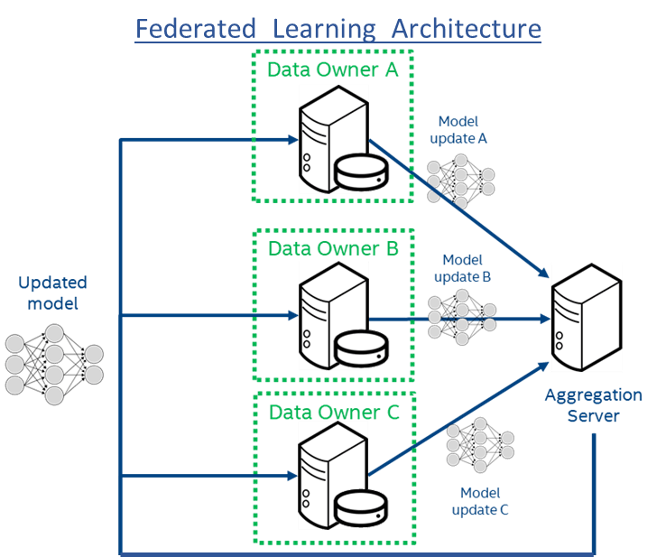

<h1 align="center">:chart_with_upwards_trend: Federated Learning for Diagnosing Acute Inflammations of Bladder :hospital:</h1>

<h2>Problem Statement</h2>

Demonstration of application of Distributed Computing in Federated Learning.

<h2>Project Summary</h2>

This machine learning system can diagnose 2 acute inflammations of bladder. The medical dataset contains features and diagnoses of 2 diseases of the urinary system: **Inflammation of urinary bladder** and **nephritis of renal pelvis origin**. This medical dataset truly needs privacy! Because we cannot divulge the sexually-transmitted diseases of patients. Federated learning will protect the privacy of datasets in each hospital and at the same time, a more robust machine learning model will benefit all hospitals. Why? Because the machine learning model generated in this project is 100% accurate; whereas human doctors can commit mistakes when diagnosing these 2 diseases. This machine learning system will leverage the advantage of distributed computing, whereby model will be sent to different computing systems (hospitals), it will be trained locally using the private data, and only the weights will be sent back to the central server in order to perform the learning. Hence, in this project, we will be simulating the distributed computing environment, which is in accordance with syllabus of our course on "Distributed and Cloud Computing". 

<h2>Dataset Used</h2>

[Link to Medical Dataset](https://archive.ics.uci.edu/ml/datasets/Acute+Inflammations)

<h2>Federated Learning with a Trusted Aggregator</h2>

In this demo, there are 4 hospitals. (The dataset will be split in 4, randomly.) There could be more hospitals. The 4 hospitals cannot share the cases of their patients because they are competitors and it is necessary to protect the privacy of patients. Hence, the ML model will be learned in a federated way.
How? Federated learning is iterated 1000 times. At each iteration, a copy of the shared model is sent to all the 4 hospitals. Each hospital trains its own local model with its own local dataset, in 5 local iterations. Each local model improves a little bit in its own direction. Then we compute the local losses and local accuracies to keep track of them and to make graphs of them. We send the local models to the trusted aggregator that will average all the model updates. This averaged model is the shared model that is sent to all the 4 hospitals at the begining of each iteration.
In this way, only the ML model will be shared. Whereas the local cases of each hospital will be kept private and they will be used to train model updates in a local way. Federated learning will protect the privacy of datasets in each hospital and at the same time, we will generate a more robust machine learning model, which will benefit all hospitals. This shared ML model preserves the privacy of individual patients and at the same time, reveals important statistics of stereotypical cases.

#### This project still has scope of development, so you can also contribute to this Project as follows:
* [Fork](https://github.com/arghyadeep99/Federated-Learning-for-Hospital-Data-Distributed-Computing) this Repository.
* Clone your Fork on a different branch:
	* `git clone -b <name-of-branch> https://github.com/arghyadeep99/Federated-Learning-for-Hospital-Data-Distributed-Computing.git`
* After adding any feature:
	* Goto your fork and create a pull request.
	* We will test your modifications and merge changes.

<b> This project was done a part of our Semester-8 course on Distributed and Cloud Computing. </b>

<h3 align="center"><b>Developed with :heart: by: </b></h3>
	
<table style="border:1px solid black;margin-left:auto;margin-right:auto;">  
  <tr>
<td>
  
     
    Arghyadeep Das

</td>

</tr>
</table>
